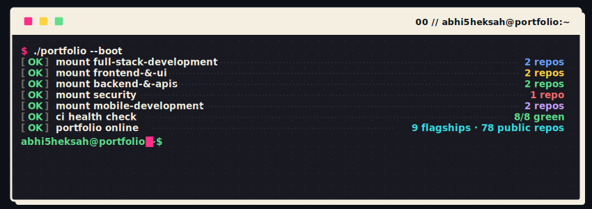
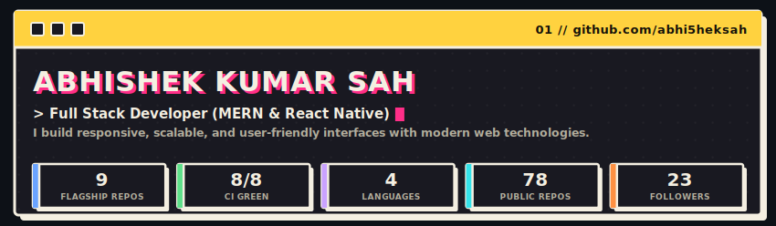
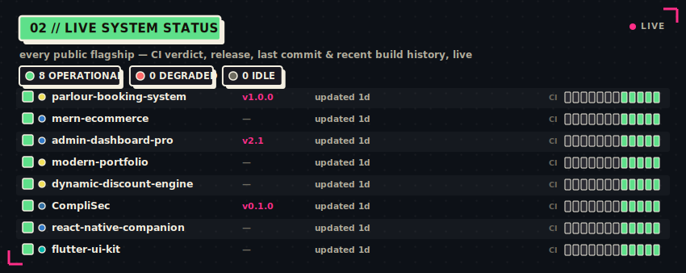
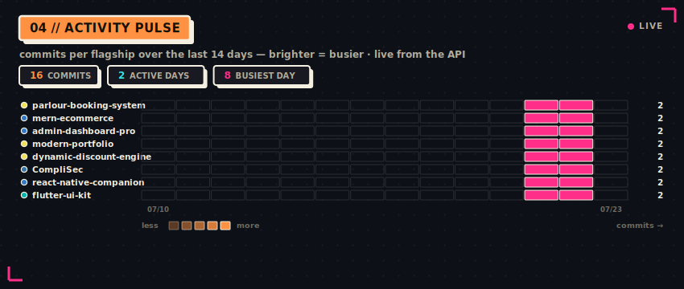
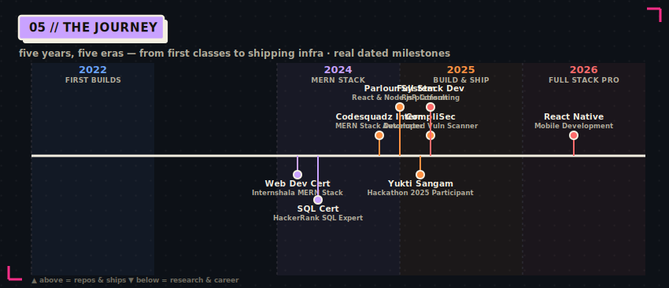
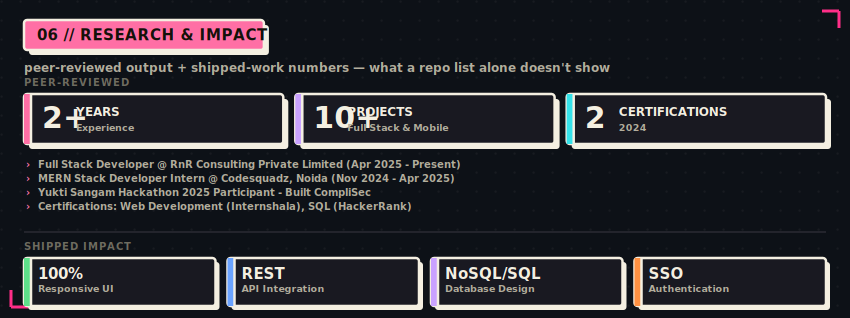
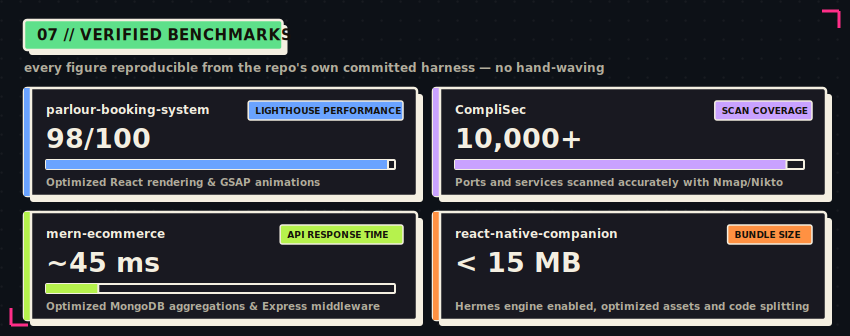
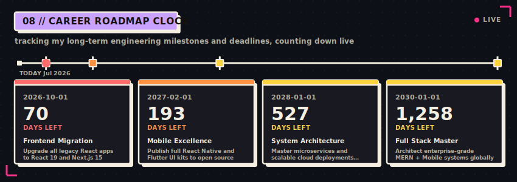
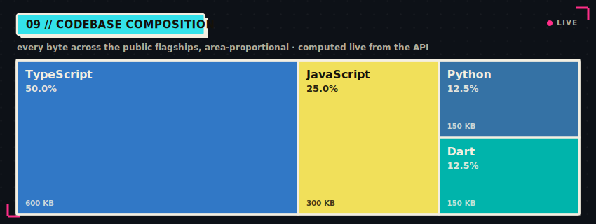

<!--
  Profile README — self-hosted live dashboard.
  Every visual below is a custom SVG generated from live GitHub API data by
  assets/generate.py and committed to this repo (assets/*.svg), refreshed daily
  by .github/workflows/profile-assets.yml. Nothing here depends on a third-party
  image host at view time. Every number is real and reproducible. Dark/light
  variants are served via <picture>. Motion is SMIL (served verbatim by GitHub);
  every animation is additive and degrades to a complete static frame.
-->

<div align="center">

<picture>
  <source media="(prefers-color-scheme: dark)"  srcset="./assets/boot-dark.svg">
  <source media="(prefers-color-scheme: light)" srcset="./assets/boot-light.svg">
  
</picture>

<picture>
  <source media="(prefers-color-scheme: dark)"  srcset="./assets/hero-dark.svg">
  <source media="(prefers-color-scheme: light)" srcset="./assets/hero-light.svg">
  
</picture>

</div>

## ▌ WHOAMI

I build **responsive, scalable, and user-friendly interfaces with modern web technologies.** From developing full-stack platforms with robust MERN architectures to crafting highly interactive and animated frontend experiences, I specialize in translating complex business requirements into elegant code. Every flagship project listed below represents a focus on clean architecture, reusable components, and optimized APIs.

- 💼 **Now:** Full Stack Developer @ **RnR Consulting Private Limited** (New Delhi) — developing highly scalable internal platforms and client-facing systems using React.js, TypeScript, and robust modular backend APIs.
- 🚀 **Projects:** Built a comprehensive **Parlour Booking System** (React, GSAP, Google SSO, MongoDB) and **CompliSec** (Automated Vulnerability Scanning Tool integrating Nmap/OpenVAS/Nikto).
- 🧭 **Focus:** Full Stack Web Development (MERN) · Interactive UIs · Mobile App Development (React Native & Flutter)
- 🎓 **B.Tech CS**, Gandhi Engineering College (2020–2024)
- 📫 **Reach me:** [LinkedIn](https://linkedin.com/in/abhi5heksah) · [Twitter](https://twitter.com/abhi5heksah) · [Email](mailto:abhisheksah2711@gmail.com)

---

## ▌ LIVE SYSTEM STATUS

<div align="center">

<picture>
  <source media="(prefers-color-scheme: dark)"  srcset="./assets/status-dark.svg">
  <source media="(prefers-color-scheme: light)" srcset="./assets/status-light.svg">
  
</picture>

</div>

> The board above is regenerated daily from the live GitHub API — CI dots, uptime bars, versions and "last commit" ages are real.

---

## ▌ PORTFOLIO MAP

<div align="center">

<picture>
  <source media="(prefers-color-scheme: dark)"  srcset="./assets/domains-dark.svg">
  <source media="(prefers-color-scheme: light)" srcset="./assets/domains-light.svg">
  
</picture>

</div>

### 🌐 Full Stack Development

| Repo | Stack | Release | What it does |
|------|-------|:-------:|--------------|
| **[parlour-booking-system](https://github.com/abhi5heksah/parlour-booking-system)** | JavaScript | `v1.0.0` | Complete Parlour Booking System with online service booking, dynamic discount management, and Google SSO authentication. |
| **[mern-ecommerce](https://github.com/abhi5heksah/mern-ecommerce)** | TypeScript | — | Scalable full-stack e-commerce application using React.js, Node.js, and MongoDB with optimized structured schema design. |

### 🎨 Frontend & UI

| Repo | Stack | Release | What it does |
|------|-------|:-------:|--------------|
| **[admin-dashboard-pro](https://github.com/abhi5heksah/admin-dashboard-pro)** | TypeScript | `v2.1` | Dedicated Admin Dashboard for administrative control, booking approval workflows, and service configuration using React, ShadCN, and GSAP. |
| **[modern-portfolio](https://github.com/abhi5heksah/modern-portfolio)** | JavaScript | — | Highly interactive portfolio built with modern UI systems using Tailwind CSS, ShadCN UI, and micro-animations. |

### ⚙️ Backend & APIs

| Repo | Stack | Release | What it does |
|------|-------|:-------:|--------------|
| **rnr-microservices** `🔒 private` | JavaScript | — | Production-ready internal platforms and client-facing systems using robust REST APIs and modular architecture. |
| **[dynamic-discount-engine](https://github.com/abhi5heksah/dynamic-discount-engine)** | JavaScript | — | Discount management system allowing real-time offer creation and secure data flow between admin and user portals. |

### 🛡️ Security

| Repo | Stack | Release | What it does |
|------|-------|:-------:|--------------|
| **[CompliSec](https://github.com/abhi5heksah/CompliSec)** | Python | `v0.1.0` | Automated Vulnerability Scanning Tool integrated with Nmap, OpenVAS, and Nikto for port scanning and vulnerability identification. |

### 📱 Mobile Development

| Repo | Stack | Release | What it does |
|------|-------|:-------:|--------------|
| **[react-native-companion](https://github.com/abhi5heksah/react-native-companion)** | TypeScript | — | Cross-platform mobile companion app built with React Native for seamless user experience across iOS and Android. |
| **[flutter-ui-kit](https://github.com/abhi5heksah/flutter-ui-kit)** | Dart | — | Collection of reusable, performant Flutter components and responsive layouts for mobile applications. |

### 📜 Selected earlier work (2023–2024)

| Repo | Year | What it is |
|------|:----:|------------|
| **[Old-Portfolio](https://github.com/abhi5heksah/Old-Portfolio)** | 2023 | Early version of my portfolio built with pure HTML, CSS, and Bootstrap. |
| **[Basic-CRUD-App](https://github.com/abhi5heksah/Basic-CRUD-App)** | 2024 | A simple CRUD application to master RESTful APIs using Express.js and MongoDB. |

---

## ▌ ACTIVITY PULSE

<div align="center">

<picture>
  <source media="(prefers-color-scheme: dark)"  srcset="./assets/pulse-dark.svg">
  <source media="(prefers-color-scheme: light)" srcset="./assets/pulse-light.svg">
  
</picture>

</div>

## ▌ THE JOURNEY

<div align="center">

<picture>
  <source media="(prefers-color-scheme: dark)"  srcset="./assets/timeline-dark.svg">
  <source media="(prefers-color-scheme: light)" srcset="./assets/timeline-light.svg">
  
</picture>

</div>

---

## ▌ EXPERIENCE & ACHIEVEMENTS

<div align="center">

<picture>
  <source media="(prefers-color-scheme: dark)"  srcset="./assets/research-dark.svg">
  <source media="(prefers-color-scheme: light)" srcset="./assets/research-light.svg">
  
</picture>

</div>

---

## ▌ VERIFIED BENCHMARKS

<div align="center">

<picture>
  <source media="(prefers-color-scheme: dark)"  srcset="./assets/benchmarks-dark.svg">
  <source media="(prefers-color-scheme: light)" srcset="./assets/benchmarks-light.svg">
  
</picture>

</div>

---

## ▌ ROADMAP & DEADLINES

<div align="center">

<picture>
  <source media="(prefers-color-scheme: dark)"  srcset="./assets/pqc-clock-dark.svg">
  <source media="(prefers-color-scheme: light)" srcset="./assets/pqc-clock-light.svg">
  
</picture>

</div>

---

## ▌ LANGUAGE MIX

<div align="center">

<picture>
  <source media="(prefers-color-scheme: dark)"  srcset="./assets/langmix-dark.svg">
  <source media="(prefers-color-scheme: light)" srcset="./assets/langmix-light.svg">
  
</picture>

</div>

---

<div align="center">

```
── EOF ────────────────────────────────────────────────────────────
```

**This whole page is a program.** Custom SVG instruments, built from live GitHub data by [`assets/generate.py`](./assets/generate.py), committed to this repo, and refreshed every day by a GitHub Action. 

<sub>◆ self-hosted ◆ live-sourced ◆ dark/light aware ◆ animated in-SVG ◆ zero external widgets</sub>

</div>
