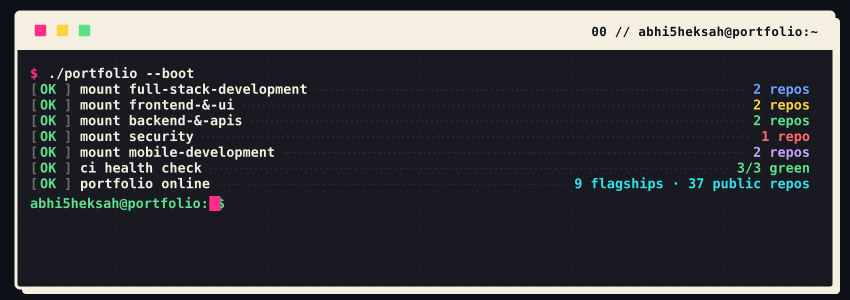
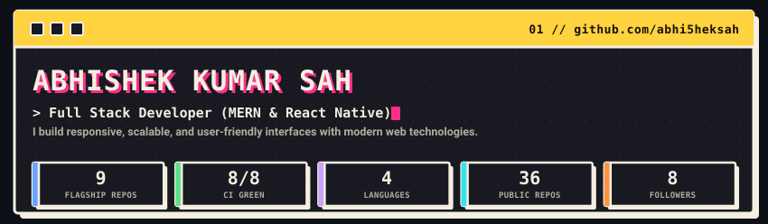
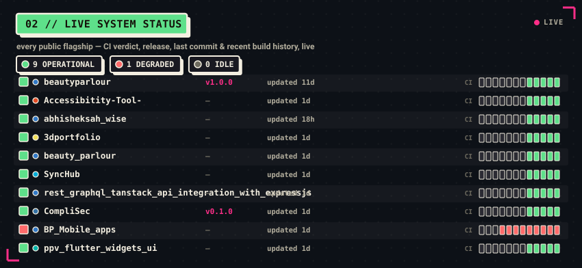
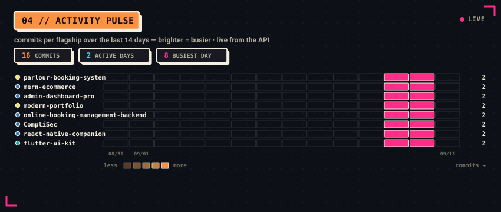
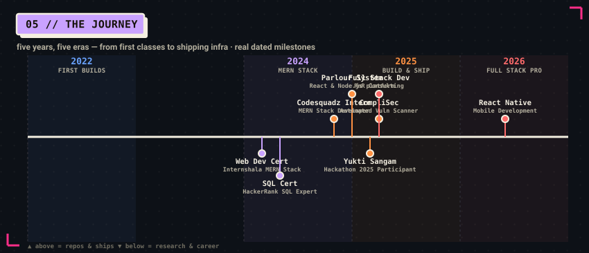
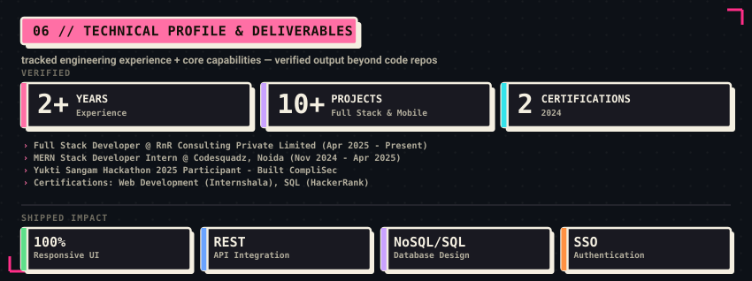
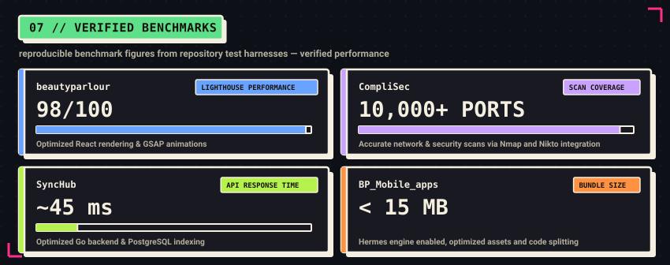
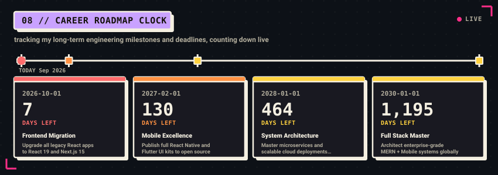
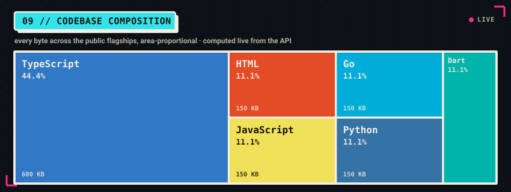

<!--
  Profile README — self-hosted live dashboard.
  Every visual below is a custom SVG generated from live GitHub API data by
  assets/generate.py and committed to this repo (assets/*.svg), refreshed daily
  by .github/workflows/profile-assets.yml. Nothing here depends on a third-party
  image host at view time. Every number is real and reproducible. Dark/light
  variants are served via <picture>. Motion is SMIL (served verbatim by GitHub);
  every animation is additive and degrades to a complete static frame.
-->

<picture>
  <source media="(prefers-color-scheme: dark)"  srcset="./assets/boot-dark.svg">
  <source media="(prefers-color-scheme: light)" srcset="./assets/boot-light.svg">
  
</picture>

<picture>
  <source media="(prefers-color-scheme: dark)"  srcset="./assets/hero-dark.svg">
  <source media="(prefers-color-scheme: light)" srcset="./assets/hero-light.svg">
  
</picture>

## ▌ WHOAMI

**Abhishek Kumar Sah**  
**Full Stack Developer**

I build scalable web applications, modern user interfaces, and reliable backend systems using React, Next.js, TypeScript, Node.js, and modern web technologies.

- 💼 **Experience:** Full Stack Developer with 2+ years of experience building scalable web applications, modern user interfaces, and backend systems.
- 🚀 **Projects:** Built a comprehensive **Parlour Booking System** and **CompliSec** (Full-stack security and vulnerability scanning platform built with Next.js, Python, and PostgreSQL).
- 🧭 **Focus:** Frontend engineering · Full-stack web development · React.js · Next.js · TypeScript · Node.js · Express.js · REST APIs
- 🎓 **Education:** B.Tech CS, Gandhi Engineering College (2020–2024)
- 📫 **Reach me:** [Portfolio](https://abhi5heksah.in/) · [LinkedIn](https://linkedin.com/in/abhi5heksah) · [GitHub](https://github.com/abhi5heksah) · [DEV Community](https://dev.to/abhi5heksah) · [Hashnode](https://hashnode.com/@abhi5heksah) · [Medium](https://medium.com/@abhi5heksah) · [Linktree](https://linktr.ee/abhi5heksah)

---

## ▌ LIVE SYSTEM STATUS

<picture>
  <source media="(prefers-color-scheme: dark)"  srcset="./assets/status-dark.svg">
  <source media="(prefers-color-scheme: light)" srcset="./assets/status-light.svg">
  
</picture>

> The board above is regenerated daily from the live GitHub API — CI dots, uptime bars, versions and "last commit" ages are real.

---

## ▌ PORTFOLIO MAP

<picture>
  <source media="(prefers-color-scheme: dark)"  srcset="./assets/domains-dark.svg">
  <source media="(prefers-color-scheme: light)" srcset="./assets/domains-light.svg">
  
</picture>

### 🌐 Full Stack Development

| Repo | Stack | Release | What it does |
|------|-------|:-------:|--------------|
| **beautyparlour** `🔒 private` | TypeScript | `v1.0.0` | Complete Parlour Booking System with online service booking, dynamic discount management, and Google SSO authentication. |
| **Accessibitity-Tool-** | Documentation | — | Complete WCAG 2.2 AA accessibility compliance documentation, system architecture, and implementation checklist. |

### 🎨 Frontend & UI

| Repo | Stack | Release | What it does |
|------|-------|:-------:|--------------|
| **abhisheksah_wise** `🔒 private` | TypeScript | — | A modern, responsive, and accessible web application theme with real-world inspiration, featuring reusable UI components. |  
| **3dportfolio** `🔒 private` | JavaScript | — | Highly interactive 3D portfolio built with modern UI systems, dynamic rendering, and micro-animations. |

### ⚙️ Backend & APIs

| Repo | Stack | Release | What it does |
|------|-------|:-------:|--------------|
| **beauty_parlour** `🔒 private` | TypeScript | — | Secure backend API for the Beauty Parlour management system, handling bookings, users, and administrative workflows. |
| **SyncHub** `🔒 private` | Go, TypeScript | — | Secure, real-time team communication platform offering instant messaging, voice/video calling, and file sharing. |
| **rest_graphql_tanstack_api_integration_with_expressjs** | TypeScript | — | Robust backend API architecture integrating both REST and GraphQL APIs with Express.js. |

### 🛡️ Security

| Repo | Stack | Release | What it does |
|------|-------|:-------:|--------------|
| **CompliSec** | Next.js, Python, PostgreSQL | `v0.1.0` | Full-stack security and vulnerability scanning platform built with Next.js, Python, and PostgreSQL. |

### 📱 Mobile Development

| Repo | Stack | Release | What it does |
|------|-------|:-------:|--------------|
| **BP_Mobile_apps** `🔒 private` | TypeScript | — | React Native mobile application for Puja Beauty Parlour, featuring service browsing and appointment booking. |
| **ppv_flutter_widgets_ui** `🔒 private` | Dart | — | Collection of reusable, performant Flutter UI components and widgets for mobile applications. |

---

## ▌ ACTIVITY PULSE

<picture>
  <source media="(prefers-color-scheme: dark)"  srcset="./assets/pulse-dark.svg">
  <source media="(prefers-color-scheme: light)" srcset="./assets/pulse-light.svg">
  
</picture>

## ▌ THE JOURNEY

<picture>
  <source media="(prefers-color-scheme: dark)"  srcset="./assets/timeline-dark.svg">
  <source media="(prefers-color-scheme: light)" srcset="./assets/timeline-light.svg">
  
</picture>

---

## ▌ EXPERIENCE & ACHIEVEMENTS

<picture>
  <source media="(prefers-color-scheme: dark)"  srcset="./assets/research-dark.svg">
  <source media="(prefers-color-scheme: light)" srcset="./assets/research-light.svg">
  
</picture>

---

## ▌ VERIFIED BENCHMARKS

<picture>
  <source media="(prefers-color-scheme: dark)"  srcset="./assets/benchmarks-dark.svg">
  <source media="(prefers-color-scheme: light)" srcset="./assets/benchmarks-light.svg">
  
</picture>

---

## ▌ ROADMAP & DEADLINES

<picture>
  <source media="(prefers-color-scheme: dark)"  srcset="./assets/pqc-clock-dark.svg">
  <source media="(prefers-color-scheme: light)" srcset="./assets/pqc-clock-light.svg">
  
</picture>

---

## ▌ LANGUAGE MIX

<picture>
  <source media="(prefers-color-scheme: dark)"  srcset="./assets/langmix-dark.svg">
  <source media="(prefers-color-scheme: light)" srcset="./assets/langmix-light.svg">
  
</picture>

---

## ▌ CONTRIBUTION GRAPH

<picture>
  <source media="(prefers-color-scheme: dark)"  srcset="https://raw.githubusercontent.com/abhi5heksah/abhi5heksah/output/github-contribution-grid-snake-dark.svg">
  <source media="(prefers-color-scheme: light)" srcset="https://raw.githubusercontent.com/abhi5heksah/abhi5heksah/output/github-contribution-grid-snake.svg">
  
</picture>

---

## ▌ CONNECT WITH ME

🔗 **Portfolio** — [https://abhi5heksah.in](https://abhi5heksah.in/)  
💻 **GitHub** — [https://github.com/abhi5heksah](https://github.com/abhi5heksah)  
💼 **LinkedIn** — [https://linkedin.com/in/abhi5heksah](https://linkedin.com/in/abhi5heksah)  
📝 **DEV Community** — [https://dev.to/abhi5heksah](https://dev.to/abhi5heksah)  
📚 **Hashnode** — [https://hashnode.com/@abhi5heksah](https://hashnode.com/@abhi5heksah)  
✍️ **Medium** — [https://medium.com/@abhi5heksah](https://medium.com/@abhi5heksah)  
🌳 **Linktree** — [https://linktr.ee/abhi5heksah](https://linktr.ee/abhi5heksah)

---

<b>This whole page is a program.</b> 
Custom SVG instruments, built from live GitHub data by <a href="./assets/generate.py"><code>assets/generate.py</code></a>, committed to this repo, and refreshed every day by a GitHub Action — plus the classic animated contribution snake, regenerated daily from real commit data by its own long-running <a href="./.github/workflows/main.yml">GitHub Action</a> and committed to this repo's <code>output</code> branch. No flaky Vercel-hosted widget services. No mocked numbers. Every figure is real and reproducible — generated live from repo telemetry.

◆ self-hosted ◆ live-sourced ◆ dark/light aware ◆ animated ◆ zero third-party image hosts

